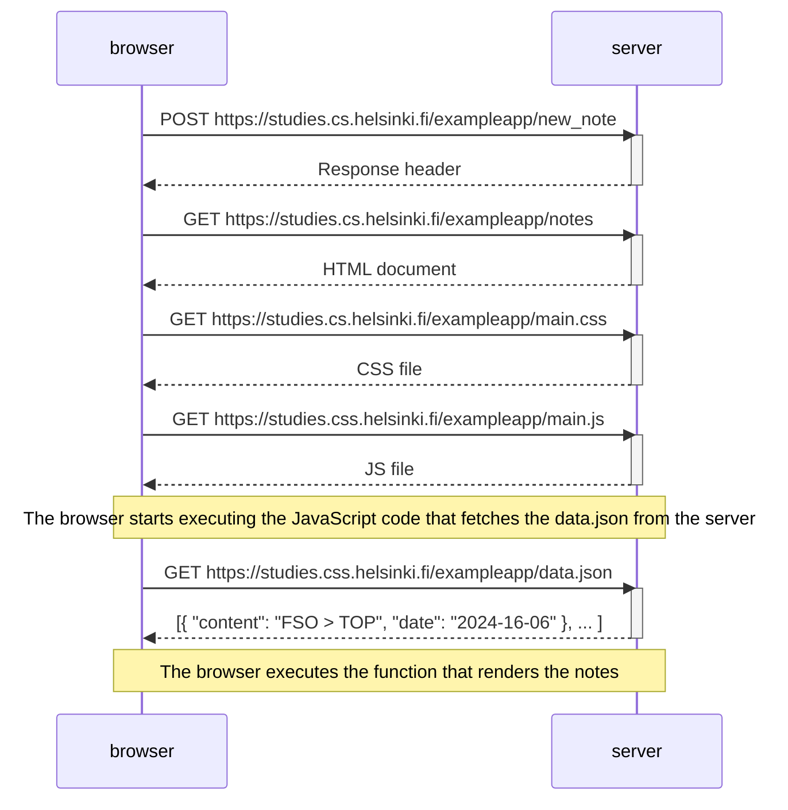

```mermaid

sequenceDiagram
    participant browser
    participant server

    browser->>server: POST https://studies.cs.helsinki.fi/exampleapp/new_note
    activate server
    server-->>browser: Response header
    deactivate server
    browser->>server: GET https://studies.cs.helsinki.fi/exampleapp/notes
    activate server
    server-->>browser: HTML document
    deactivate server

    browser->>server: GET https://studies.cs.helsinki.fi/exampleapp/main.css
    activate server
    server-->>browser: CSS file
    deactivate server

    browser->>server: GET https://studies.css.helsinki.fi/exampleapp/main.js
    activate server
    server-->>browser: JS file
    deactivate server
    Note over browser, server: The browser starts executing the JavaScript code that fetches the data.json from the server

    browser->>server: GET https://studies.css.helsinki.fi/exampleapp/data.json
    activate server
    server-->>browser: [{ "content": "FSO > TOP", "date": "2024-16-06" }, ... ]
    deactivate server

    Note over browser, server: The browser executes the function that renders the notes


```
