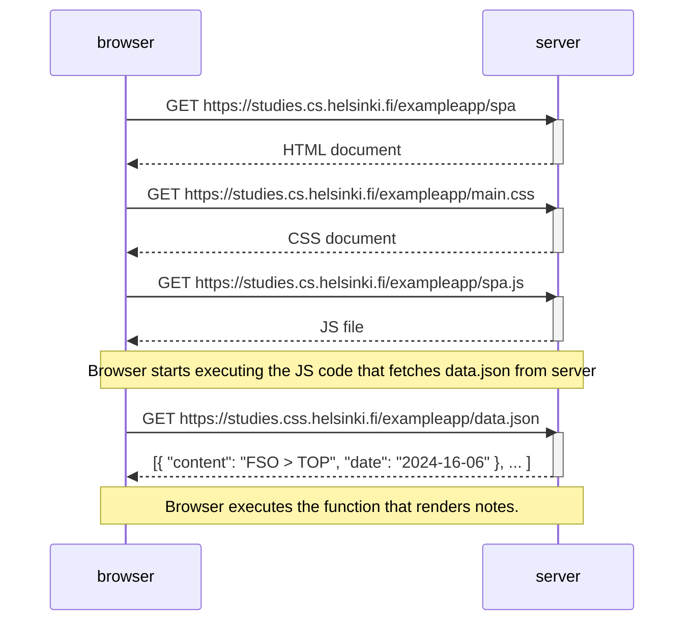

```mermaid

sequenceDiagram
    participant browser
    participant server

    browser->>server: GET https://studies.cs.helsinki.fi/exampleapp/spa
    activate server
    server-->>browser: HTML document
    deactivate server

    browser->>server: GET https://studies.cs.helsinki.fi/exampleapp/main.css
    activate server
    server-->>browser: CSS document
    deactivate server

    browser->>server: GET https://studies.cs.helsinki.fi/exampleapp/spa.js
    activate server
    server-->>browser: JS file
    deactivate server
    Note over browser, server: Browser starts executing the JS code that fetches data.json from server

    browser->>server: GET https://studies.css.helsinki.fi/exampleapp/data.json
    activate server
    server-->>browser: [{ "content": "FSO > TOP", "date": "2024-16-06" }, ... ]
    deactivate server
    Note over browser, server: Browser executes the function that renders notes.

```
